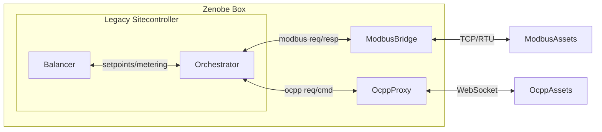

# Site Asset Orchestrator

This project is a proof-of-concept for using an Entity-Component-System (ECS) architecture (via [Bevy](https://bevy.org)) to manage and coordinate asset communication and control logic for a site controller, potentially as a replacement for the current C++ asset-thread model. It demonstrates how to bridge between Modbus and OCPP assets and a central balancer, using explicit message queues and ECS-driven logic.

---

## Architecture Overview



### ECS (Entity-Component-System)

- **Entities**: Each asset (charger, battery, etc.) is an entity.
- **Components**: Asset properties (e.g., `ExternalId`, `OcppConfig`, `ChargerElectricalConfig`, etc.) are attached as components.
- **Systems**: Logic is implemented as systems that run each frame, processing events, updating components, and handling communication.

This ECS approach allows for:
- Decoupled, data-driven logic.
- Easy extension and composition of asset behaviors.
- Accelerated testing—want to simulate an 8 hour charging session in an integration test? Just increase the Bevy frequency.

### Communication Queues

The project uses [crossbeam-channel](https://docs.rs/crossbeam-channel/) queues to decouple external I/O from the ECS world. There are six main queues:

#### Balancer <-> Orchestrator
- **balancer_setpoint_sender / balancer_setpoint_receiver**: For sending setpoints from the balancer (a now external optimiser) into the Orchestrator
- **balancer_metering_sender / balancer_metering_receiver**: For sending metering data from the Orchestrator out to the balancer.

#### Modbus <-> Orchestrator
- **modbus_request_sender / modbus_request_receiver**: For the Orchestrator to enqueue Modbus requests to the Modbus Bridge.
- **modbus_response_sender / modbus_response_receiver**: For the Modbus Bridge to send Modbus responses back into the Orchestrator

#### OCPP <-> Orchestrator
- **ocpp_request_sender / ocpp_request_receiver**: For the OCPP Proxy to send requests/events into the Orchestrator
- **ocpp_command_sender / ocpp_command_receiver**: For the Orchestrator to send OCPP commands/responses out to the OCPP Proxy.

All queues are exposed in the `AppExternalChannelEnds` struct returned by `setup_bevy_app`.

---

## System Integration

It is envisioned that the **Modbus Bridge** and **OCPP Proxy** are responsible for actual communication with physical assets. They consume and produce messages via the queues exposed by this Orchestrator, translating between protocol-specific wire formats and the ECS-driven logic.

---

## Motivation: Replacing the C++ Asset Threads

In the sitecontroller, each asset (charger, battery, etc.) is managed by a dedicated thread, handling protocol I/O and state. This PoC demonstrates how to replace that model with a single ECS-driven application, where:
- All asset logic is centralised and separated from data.
- Communication with the outside world (balancer, OCPP, Modbus) is handled via explicit queues.
- Asset state and control logic are managed by ECS systems, not per-asset threads.

---

## Example Implementations and Features

### Alfen Startup Logic

Some assets (e.g., Alfen chargers) require special initialization sequences. This is implemented as a dedicated system (`alfen_special_init_system`) that runs after generic initialization and only for assets with the `AlfenSpecificConfig` component. This demonstrates how protocol- or vendor-specific logic can be layered on top of the generic ECS asset model.

### Power-to-Amps Translation

When sending OCPP `SetChargingProfileRequest` messages, the system translates a target power setpoint (in kW) into a per-phase current limit (in Amps) if the asset's profile behavior is configured for Amps. This mirrors the logic in the C++ `CProfile_Limit_Calculator_A` class, ensuring protocol compliance and correct physical behavior.

### Configurable Asset Spawning

Assets and their templates are defined in a JSON config file (`assets/site_config.json`). This config is loaded at startup and injected into the ECS world, allowing for flexible, testable asset definitions.

---

## Running the Integration Tests

### Prerequisites

- Rust toolchain (1.70+ recommended)
- [Bevy](https://bevyengine.org/) (added as a dependency)
- No external services required; all communication is in-memory

### Steps

1. **Clone the repository and enter the project directory.**

2. **Run the integration test:**
   ```sh
   cargo test
   ```

   This will:
   - Start a Bevy app with a minimal asset config (provided inline in the test).
   - Simulate OCPP BootNotification and StatusNotification messages.
   - Send setpoints from the balancer channel.
   - Assert that the correct OCPP commands (with correct units and values) are generated and sent.

3. **Debugging:**
   - Use `RUST_LOG=debug cargo test` to see detailed logs of system execution and message flow.

---

## Project Structure

- `src/app_setup.rs`: Sets up the Bevy app, all plugins, and all communication channels.
- `src/asset_template_plugin/`: Handles asset spawning from config.
- `src/core_asset_plugin/`: Defines core asset components and debug systems.
- `src/ocpp_protocol_plugin/`: OCPP protocol logic, event translation, and profile calculation.
- `src/modbus_protocol_plugin/`: Modbus protocol logic and event translation.
- `src/balancer_comms_plugin/`: Balancer communication logic.
- `tests/integration_tests.rs`: End-to-end integration test for charger connect and setpoint update.